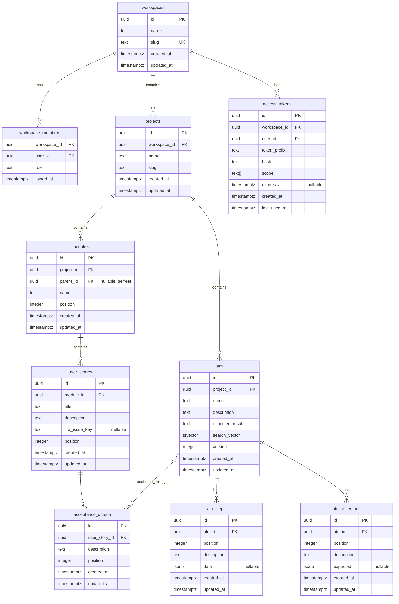
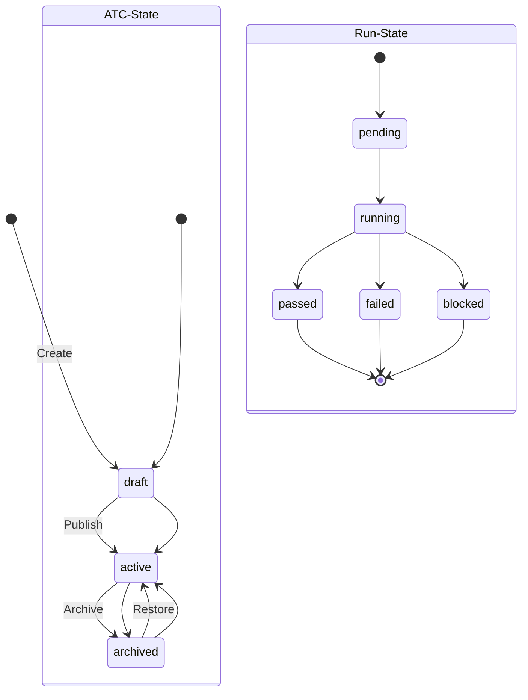

# Domain Glossary — Bunkai

> Generated: 2026-06-06
> Sources: `../upex-bunkai-tms/supabase/migrations/*.sql`, `../upex-bunkai-tms/lib/types.ts`, `../upex-bunkai-tms/.context/business/business-data-map.md`

## Core Entities

### Workspace

| Field | Type | Description |
|-------|------|-------------|
| Technical Name | `workspaces` | Multi-tenant root entity |
| Business Name | Workspace | Organization-level container |
| Table | `workspaces` | |
| Key Attributes | `id` (UUID PK), `name` (text), `slug` (unique), `created_at`, `updated_at` | |
| Found In | `supabase/migrations/0001_tenancy.sql`, `lib/types.ts` | |

**Relationships**: Has many `workspace_members`, Has many `projects`

### WorkspaceMember

| Field | Type | Description |
|-------|------|-------------|
| Technical Name | `workspace_members` | User membership in workspace |
| Business Name | Member | User with role in a workspace |
| Table | `workspace_members` | |
| Key Attributes | `workspace_id` (FK), `user_id` (FK), `role` (enum), `joined_at` | |
| Found In | `supabase/migrations/0001_tenancy.sql` | |

**Relationships**: Belongs to `workspaces`, Belongs to `users` (auth.users)

### Project

| Field | Type | Description |
|-------|------|-------------|
| Technical Name | `projects` | Top-level test project |
| Business Name | Project | Collection of modules and tests |
| Table | `projects` | |
| Key Attributes | `id` (UUID PK), `workspace_id` (FK), `name` (text), `slug` (text), `created_at`, `updated_at` | |
| Found In | `supabase/migrations/0002_projects_modules.sql`, `lib/types.ts` | |

**Relationships**: Belongs to `workspaces`, Has many `modules`

### Module

| Field | Type | Description |
|-------|------|-------------|
| Technical Name | `modules` | Self-referential tree node (max depth 6) |
| Business Name | Module | Folder/category for organizing test artifacts |
| Table | `modules` | |
| Key Attributes | `id` (UUID PK), `project_id` (FK), `parent_id` (FK self-ref, nullable), `name` (text), `position` (integer), `created_at`, `updated_at` | |
| Found In | `supabase/migrations/0002_projects_modules.sql`, `lib/types.ts` | |

**Relationships**: Belongs to `projects`, Belongs to self (`parent_id`), Has many `user_stories`

### UserStory

| Field | Type | Description |
|-------|------|-------------|
| Technical Name | `user_stories` | Feature description from user perspective |
| Business Name | User Story | Requirements unit |
| Table | `user_stories` | |
| Key Attributes | `id` (UUID PK), `module_id` (FK), `title` (text), `description` (markdown), `jira_issue_key` (text nullable), `position` (integer), `created_at`, `updated_at` | |
| Found In | `supabase/migrations/0003_authoring.sql`, `lib/types.ts` | |

**Relationships**: Belongs to `modules`, Has many `acceptance_criteria`

### AcceptanceCriterion

| Field | Type | Description |
|-------|------|-------------|
| Technical Name | `acceptance_criteria` | Condition that a story must satisfy |
| Business Name | Acceptance Criterion (AC) | Gherkin-style condition |
| Table | `acceptance_criteria` | |
| Key Attributes | `id` (UUID PK), `user_story_id` (FK), `description` (markdown/Gherkin), `position` (integer), `created_at`, `updated_at` | |
| Found In | `supabase/migrations/0003_authoring.sql`, `lib/types.ts` | |

**Relationships**: Belongs to `user_stories`, Has many ATCs through junction table `atc_acceptance_criteria`

### Atc (Atomic Test Component)

| Field | Type | Description |
|-------|------|-------------|
| Technical Name | `atcs` | Atomic, reusable test action |
| Business Name | ATC | Smallest testable unit (e.g. "Login with valid credentials") |
| Table | `atcs` | |
| Key Attributes | `id` (UUID PK), `project_id` (FK), `name` (text), `description` (text), `expected_result` (text), `search_vector` (tsvector), `version` (integer), `created_at`, `updated_at` | |
| Found In | `supabase/migrations/0004_atcs.sql`, `lib/types.ts` | |

**Relationships**: Belongs to `projects`, Has many `atc_steps`, Has many `atc_assertions`, Has many `acceptance_criteria` through `atc_acceptance_criteria`

### AtcStep

| Field | Type | Description |
|-------|------|-------------|
| Technical Name | `atc_steps` | Ordered step within an ATC |
| Business Name | Step | Action instruction (e.g. "Enter email") |
| Table | `atc_steps` | |
| Key Attributes | `id` (UUID PK), `atc_id` (FK), `position` (integer), `description` (text), `data` (jsonb nullable), `created_at`, `updated_at` | |
| Found In | `supabase/migrations/0004_atcs.sql` | |

**Relationships**: Belongs to `atcs`

### AtcAssertion

| Field | Type | Description |
|-------|------|-------------|
| Technical Name | `atc_assertions` | Expected outcome within an ATC |
| Business Name | Assertion | Verification point (e.g. "Dashboard shows logged-in user") |
| Table | `atc_assertions` | |
| Key Attributes | `id` (UUID PK), `atc_id` (FK), `position` (integer), `description` (text), `expected` (jsonb nullable), `created_at`, `updated_at` | |
| Found In | `supabase/migrations/0004_atcs.sql` | |

**Relationships**: Belongs to `atcs`

### AccessToken

| Field | Type | Description |
|-------|------|-------------|
| Technical Name | `access_tokens` | PAT for CLI/AI/auth |
| Business Name | Personal Access Token (PAT) | API credential for agentic/automated access |
| Table | `access_tokens` | |
| Key Attributes | `id` (UUID PK), `workspace_id` (FK), `user_id` (FK), `token_prefix` (text), `hash` (text), `scope` (text[]), `expires_at` (timestamptz nullable), `created_at`, `last_used_at` | |
| Found In | `supabase/migrations/0008_access_tokens.sql`, `lib/types.ts` | |

**Relationships**: Belongs to `workspaces`, Belongs to `users`

## Enumerations and Constants

### Role (workspace_members.role)

| Value | Business Meaning | Usage Context |
|-------|-----------------|---------------|
| `owner` | Full workspace admin | CRUD everything, manage members |
| `admin` | Workspace administrator | CRUD everything except billing/members |
| `member` | Standard contributor | Create/edit tests, runs, bugs in assigned modules |
| `viewer` | Read-only access | View reports, runs, dashboards |

Found In: `supabase/migrations/0001_tenancy.sql`

### Status (shared across entities)

| Value | Business Meaning | Usage Context |
|-------|-----------------|---------------|
| `draft` | Being created | UserStory, AcceptanceCriterion, Atc, Test, Run |
| `active` | Ready for use | UserStory, AcceptanceCriterion, Atc, Test |
| `completed` | Done | Run |
| `archived` | No longer in use | UserStory, AcceptanceCriterion, Atc, Test |

### PAT Scope Values

| Value | Business Meaning |
|-------|-----------------|
| `atc:read` | Read ATCs |
| `atc:write` | Create/update ATCs |
| `run:execute` | Execute test runs |
| `workspace:admin` | Admin workspace |

Found In: `lib/types.ts`, `supabase/migrations/0008_access_tokens.sql`

## Entity Relationships Diagram

## Business Rules

### BR-001: ATC Must Anchor to Acceptance Criterion
- **Description**: Every ATC must be linked to at least one Acceptance Criterion via the `atc_acceptance_criteria` junction table
- **Entities Affected**: ATC, AcceptanceCriterion
- **Validation**: FK constraint + application-level check in `bunkai_save_atc()` RPC
- **Found In**: `supabase/migrations/0004_atcs.sql` — `atc_acceptance_criteria` junction table

### BR-002: Module Tree Max Depth 6
- **Description**: Module hierarchy cannot exceed 6 levels (self-referential tree)
- **Entities Affected**: Module
- **Validation**: Application-level check before insert
- **Found In**: `supabase/migrations/0002_projects_modules.sql` — `parent_id` self-ref FK

### BR-003: Workspace Membership Required for Access
- **Description**: All data access is gated by RLS policies checking `workspace_members`
- **Entities Affected**: All entities
- **Validation**: RLS policies on every table
- **Error Message**: HTTP 403 / `insufficient_permission`
- **Found In**: All migration files — RLS policies on each table

### BR-004: PAT Hash Comparison is Constant-Time
- **Description**: Bearer token validation uses constant-time SHA-256 hash comparison to prevent timing attacks
- **Entities Affected**: AccessToken
- **Validation**: `lib/api/middleware/bearer.ts` — `crypto.timingSafeEqual`
- **Found In**: `lib/api/middleware/bearer.ts`

## Terminology Mapping

### Technical → Business

| Technical | Business |
|-----------|----------|
| `workspace` | Organization / Team |
| `workspace_member` | Team Member |
| `project` | Test Project |
| `module` | Test Module / Folder |
| `user_story` | User Story |
| `acceptance_criterion` | Acceptance Criterion (AC) |
| `atc` | Atomic Test Component (ATC) |
| `atc_step` | Test Step |
| `atc_assertion` | Test Assertion / Verification |
| `access_token` | Personal Access Token (PAT) |

### Abbreviations

| Abbreviation | Expansion |
|-------------|-----------|
| ATC | Atomic Test Component |
| AC | Acceptance Criterion |
| PAT | Personal Access Token |
| RLS | Row-Level Security |
| TMS | Test Management System |
| US | User Story |

## Status / State Flows

## UI Labels Reference

### Key Form Fields

| Field | UI Label | Technical Field |
|-------|----------|-----------------|
| ATC Name | "ATC Name" | `atcs.name` |
| ATC Description | "Description" | `atcs.description` |
| Step Description | "Step" | `atc_steps.description` |
| Step Data | "Test Data" | `atc_steps.data` |
| Assertion | "Expected Result" | `atc_assertions.description` |
| User Story Title | "Title" | `user_stories.title` |
| User Story Description | "Description" | `user_stories.description` |
| Module Name | "Module Name" | `modules.name` |
| Project Name | "Project Name" | `projects.name` |
| Workspace Name | "Workspace Name" | `workspaces.name` |

### Key Action Buttons

| Button | Action | Endpoint |
|--------|--------|----------|
| "Save ATC" | Save atomic test component | `bunkai_save_atc()` RPC |
| "Create Project" | Create new project | `POST /api/v1/projects` |
| "Add Step" | Add step to ATC | Client-side → `bunkai_save_atc()` |
| "Add Assertion" | Add assertion to ATC | Client-side → `bunkai_save_atc()` |
| "Add User Story" | Create user story | `POST /api/v1/user-stories` |
| "Add AC" | Add acceptance criterion | `POST /api/v1/acceptance-criteria` |
| "Anchor to US" | Link ATC to user story | `POST /api/v1/anchoring` |

## QA Usage Guide

This glossary supports the following testing activities:

- **Test Data Creation**: Use entity table definitions and JSON examples to construct valid test payloads
- **State Transition Testing**: Use state diagrams to verify all legal transitions and reject illegal ones
- **RLS Testing**: Use role enum values to verify permission boundaries per entity
- **API Testing**: Use endpoint patterns and expected payload shapes from entity tables
- **UI Testing**: Use UI labels and button names for locator strategies and assertion targets
- **Business Rule Testing**: Use BR entries to derive negative test cases

## Discovery Gaps

- [ ] Direct DB access not configured — entity example values inferred from migration SQL, not from live data sampling
- [ ] Some endpoint paths (projects, user-stories, etc.) may have different actual routes — need to verify via target `app/api/` or OpenAPI spec
- [ ] UI label references based on component code — i18n files may contain canonical translations not yet checked
